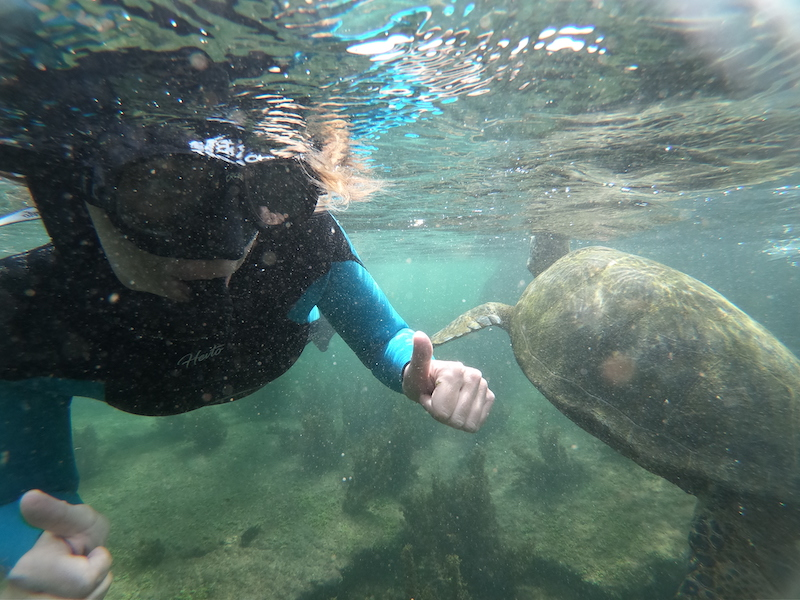

Bien que le sport national semble être la sieste à en croire les lions de mer,
les Galápagaos regorgent d'activités pour découvrir la faune et la flore.

Alors on embarque? Faisons un petit tour des attractions.

# Santa Cruz

## Le centre d'élevage des tortues

Nous sommes tombés complètement par hasard sur cette activité. En longeant la rue qui borde la mer, nous finissons par
entrer dans un parc naturel. Un choix s'offre à nous:
* Le chemin de gauche accessible seulement avec un guide payant (10$ par personne) nous emmène au coeur du centre d'élevage
* Le chemin de droite permet d'accéder à une plage et à une boutique de souvenirs

La question est vite répondue: on opte pour le chemin de droite.

Après une petite promenade au sein des champs de cactus, on en apprend un peu plus sur la faune et la flore. Au fil des
explications on se rend compte à quel point cette nature est fragile. Le moindre import d'une espèce peut rompre cet
équilibre.

En ce qui concerne nos amis les tortues elles n'ont pas la vie facile. Elles ont failli connaître l'extinction il y'a
quelques dizaines d'années. Le taux de survie d'un bébé tortue est de seulement 1%! Le but du centre est donc de récupérer
les œufs pour les faire éclore et relâcher les tortues quand elles auront.... 10 ans! Malgré tout cela, le taux de survie
n'est que de 50%. Ses efforts ne sont pas vains mais soyez patient on en reparle pour une autre activité. À vous de deviner laquelle!

*Elles sont pas mimis ces petites tortues?*

*Celle-là est bien plus vieille*

Bref cette balade est riche d'enseignements. Cerise sur le gâteau nous avons eu le droit à notre tampon de George le
solitaire (la dernière tortue de son espèce) sur notre passeport!

*Le fameux George sur notre passport*

## Tortuga bay

D'abord d'où vient le nom de cette baie? Tout simplement, c'est le lieu privilégié par nos amies tortues pour faire leurs
nids.

Pour se rendre à cette fameuse baie, on commence par longer un chemin qui traverse les champs de lave. Ça monte, ça descend,
ça montre bref le chemin est assez vallonné. Après au moins 30 minutes de marche, on commence à entendre le bruit des vagues au loin.
On approche du but! Après une dernière montée, on débouche enfin sur cette fameuse baie! Plage à perte de vue, notre longue
marche était récompensée.

*On entrevoit la plage!*

Nous longeons la plage sur la droite pour pouvoir aller se baigner (interdiction de se baigner sur la partie gauche car trop de courant).
Nous croisons des groupes d'iguanes en train de prendre le soleil. On découvre au passage qu'il crache de l'eau par moment. Ça
peut surprendre surtout quand on tente une photo de près. Après une sorte de petit bois, on tombe sur la fameuse plage où l'on peut se baigner!

*Quelques secondes avant le crachat...*

L'eau est plutôt chaude et c'est vraiment agréable de pouvoir se baigner après une bonne marche. Anne-Cha parvient même
à repérer une raie qui se cache dans le sable en marchant dans l'eau.

Le lieu est vraiment beau et vaut le détour, cependant un vil ennemi se cache: le soleil... Et oui, bien que le temps soit couvert, nous
sommes revenus rouges de notre balade. Premier avertissement, le soleil tape fort, très fort! Biafine party incoming...

# Isla Isabela

## Kayak à las Tintoreras

Las Tintoreras est un îlot proche de Puerto Villamil, que l'on peut atteindre en kayak. Nous embarquons,
Anne-Cha à l'avant moi à l'arrière pour la navigation et c'est parti!

Notre guide nous emmène près d'une formation rocheuse et coup de chance, nous pouvons voir des pingouins en train de se reposer.

*Coucou les pingouins*

Nous continuons la visite et nous pouvons voir des lions de mer, des crabes. Nous avons aussi vu un aileron de requin et des tortues!
Tout ce beau monde nageait sous nos embarcations.

Le clou du spectacle: un pingouin est venu nager entre nos embarcations! Il jouait, virevoltait et sautait hors de l'eau juste à côté de nous.

Je ne vous cache pas que nous avons eu quelques courbatures aux épaules le lendemain, mais ça en valait vraiment la peine.

## La concha de perla

La concha de perla se situe non loin de l'embarcadère pour le ferry, réputé être un super spot pour le snorkeling.
Il n'en fallait pas plus pour nous convaincre d'y aller. On emprunte un petit ponton en bois dissimulé derrière une sorte de stand.
Mieux vaut être prévenu, il n'est pas impossible que des iguanes ou des lions de mer vous barrent le passage. Vous pouvez
les enjamber sans déranger le cours de leur sieste.

La concha de perla en elle même n'est pas spécialement jolie, c'est un morceau de mer délimité par des balises que l'on ne doit
pas dépasser lors de notre séance de snorkeling.

On enfile notre équipement et on se met à l'eau. Si la concha d'extérieur ne paye pas de mine, une fois dans l'eau nous avons
la chance de voir des poissons colorés à foison. De mon côté je m'aventure vers les eaux plus profondes au centre. Sous mes yeux, un banc de six
raies tachetées nage tranquillement. Je voulais en faire profiter Anne-Cha mais elle était plus occupée à jouer avec un lion de mer. La veinarde!
Je vous rassure elle a aussi réussi à voir le banc de raies.

Nous confirmons que la concha de perla est un super sport pour le snorkeling. D'ailleurs nous y sommes retournés deux fois et en plus c'est gratuit!
Le mieux est de s'y rendre quand il n'y a pas trop de monde.

## La sierra negra

L'île Isabela est constituée de 5 volcans, rien que ça! Les volcans sont d'ailleurs toujours en activité et des éruptions
ont lieu environ tous les 15 ans. La plupart de ces volcans ne sont pas accessibles. Le seul que l'on peut visiter est la sierra Negra.
Un volcan bouclier qui se niche à 1124m d'altitude.

Rendez-vous est donné à 7h avec notre guide. On part en jeep direction le centre de l'île. Après 20 minutes de transport,
on arrive au point de départ du trek. L'heure est venue de constituer les groupes. Il y'a un guide anglophone et un guide espagnol.
Ça tombe bien, nous souhaitons améliorer notre espagnol. La chance est de notre côté nous sommes seulement 4 dans le groupe contre une vingtaine
pour le groupe anglophone.

Une fois les groupes établis nous entamons la randonnée. La première partie est assez pentue et dure une vingtaine de minutes.
Nous traversons une végétation riche car le centre de l'île est plus humide.

*Vraiment très humide*

Nous arrivons au mirador, et là, la caldeira est GIGANTESQUE! Elle fait 9km x 7km. C'est tellement grand que les notions
de distance sont perturbées.

*C'est grand, très grand, ça ne tient pas sur ma photo*

Après le mirador nous nous dirigeons vers les champs de lave. Là c'est 2 salles 2 ambiances. Nous passons d'une végétation
assez fournie à des champs de roches basaltiques à perte de vue. Le chemin est assez escarpé et il faut faire attention de
ne pas se blesser. Après 2h de marche, nous arrivons près d'un autre volcan: El Chico.

*Bon ok il n'y a pas que de la lave, il y a des cactus aussi*

*lava, lava everywhere*

*Notre guide, trop sympa!*

Nous faisons une pause et profitons du paysage qui mêle champs de lave et mer en tableau de fond.

*Une pause bien méritée*

Le chemin du retour est bien plus dur que l'aller. Nous prenons notre temps et bouclons la randonnée en 6h environ.
Après les courbatures aux bras du kayak, ce sera au tour des jambes d'être courbaturées...

## El muro de lagrimas

Pour cette activité, nous optons pour le vélo car il faut parcourir 6km. Nous louons 2 vélos (3$ de l'heure) et nous nous
dirigeons vers le mur des larmes.

Le trajet est, comment dire, très pentu! ça monte, ça monte, ça monte (si vous n'avez pas suivi ça monte). Les jambes commencent
à brûler. De plus, on alterne les terrains durs et d'autres plus sablonneux. La marche n'était peut-être pas si mal finalement!

Comme pour toutes les autres activités, nos efforts sont récompensés et on aperçoit nos premières tortues de terre. Dissimulées
dans les fourrés, il est difficile de les apercevoir car elles se confondent avec le décor.

Quelques montées plus loin, on arrive enfin au mur de larmes. Cet endroit fait froid dans le dos. Nous arrivons devant un
mur immense érigé jusqu'en 1959 par des prisonniers. Nombreux sont morts en déplaçant ces énormes blocs de lave. De plus, l'endroit
n'offre que très peu d'ombre. Nous préférons ne pas trop rester et décidons de rentrer après une petite pause (le vélo ça creuse).

Le retour sera plus aisé. Dernier conseil pour la route, vérifiez bien votre vélo avant de partir, n'est-ce pas Anne-Cha?

## Los Tuneles

Je vais être direct, ça a été notre activité préférée. Cela commence par un voyage en bateau d'une petite heure.

Une fois arrivées à los tuneles nous mangeons un morceau sur le bateau. 

Ensuite nous partons en expédition terrestre. Mieux vaut prévoir des chaussures fermées. J'étais en tongs sur les roches et j'ai cru perdre un doigt de pieds à plusieurs
reprises. Finalement j'en perdrai un mais c'est une tout autre histoire.

*Tel un équilibriste!*

Bon ok, ça semble pas foufou pour le moment mais attendez qu'on attaque le meilleur. Après avoir vu quelques requins dormir lors
de notre balade terrestre, nous revenons au bateau pour enfiler l'équipement de snorkeling et plouf à l'eau.

Il n'aura pas fallu plus de 10 minutes de nage pour que je repère un requin en train de nager. Je préviens Anne-Cha et
nous le contemplons nager. Nous continuons notre balade et croisons plusieurs nids de requins.

*Je vous rassure ils ne mordent pas*

Puis vint ce moment, ce moment magique. Nous voyons une première tortue puis une 2ème puis une 3ème. Bref des tortues il y en avait partout au point que j'avais
peur d'en toucher une s'en m'en apercevoir. Ce moment est inoubliable, voir cet être évoluer dans l'eau est indescriptible.
Nous sommes comme retombés en enfance.

*Elle est si grande!*

<iframe width="560" height="315" src="https://www.youtube.com/embed/TNLTqdNBHyY" title="YouTube video player" frameborder="0" allow="accelerometer; autoplay; clipboard-write; encrypted-media; gyroscope; picture-in-picture" allowfullscreen></iframe>

Nous repartons de là avec des étoiles pleins les yeux. Si nous devions retenir qu'une activité ce serait celle-là, clairement!

Un grande merci à [Paddle To The Penguins](https://www.paddletothepenguins.com/) de nous avoir organisé toutes ces activités
sur l'île Isabela. Kévin le gérant est vraiment très sympa et conciliant. Le gros point positif est l'équipement qui est quasi neuf.
Il est préférable de réserver directement sur place pour bénéficier de prix plus avantageux.
