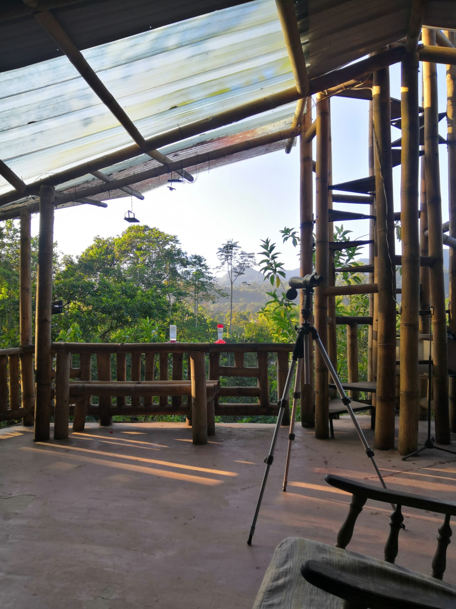
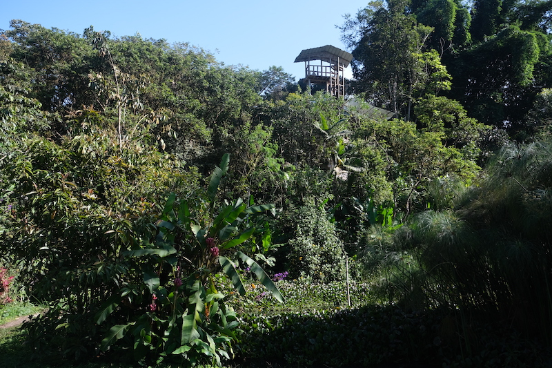
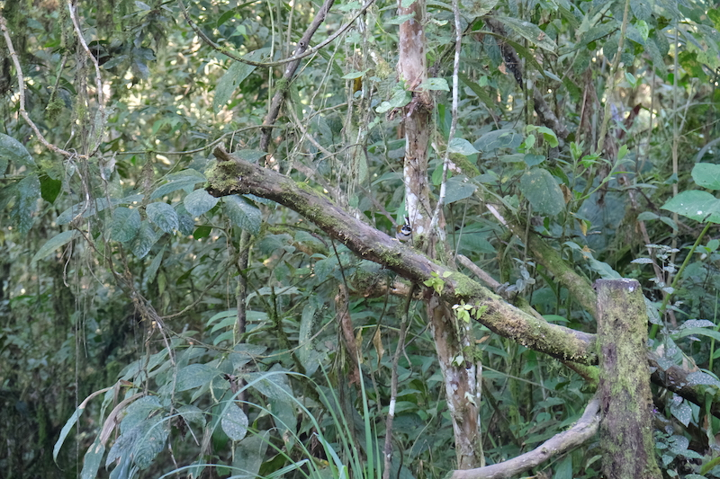
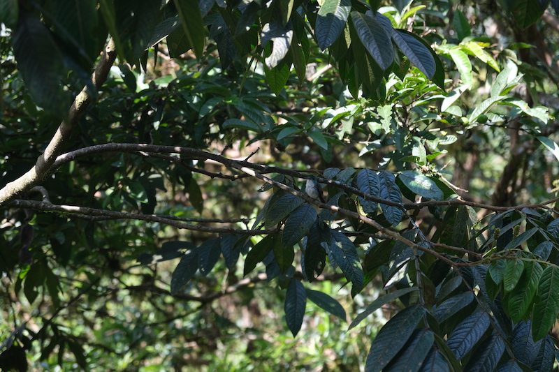
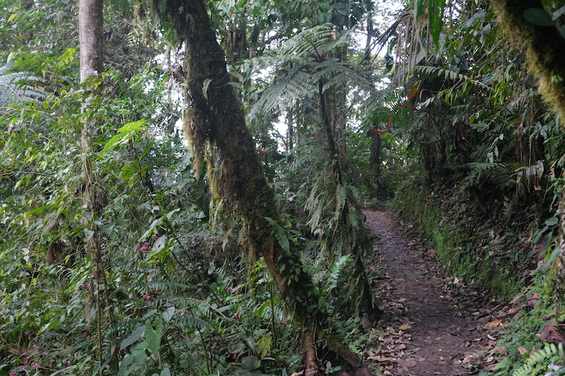

Comme vous avez pu le suivre dans un des articles précédents, je suis arrivé à Mindo avec le petit doigt de pieds
cassé. 

Par chance, je commençais à pouvoir marcher en faisant attention de ne pas mettre trop de poids sur l'extérieur du pied.
Dans le taxi qui nous amène à Mindo, nous lui demandons s'il peut nous emmener le lendemain matin pour observer les oiseaux
et ensuite une ferme de papillons

Le rendez-vous est pris et le lendemain vers 9h nous prenons le taxi qui nous emmène à un des points culminant
de Mindo. Chouette nous allons pouvoir observer les oiseaux. Sauf qu'avec notre Espagnol approximatif, nous voilà
embarqués pour faire de la zipline... Maintenant qu'on y est, difficile de faire marche arrière.

## Zipline

La zipline c'est 10 câbles suspendus au-dessus de la canopée de Mindo. Nous nous équipons, je précise quand même que j'ai
le petit doigt de pied cassé aux guides qui me répondent que "pas de problème ça va le faire!"

Ok nous leur faisons confiance et nous voilà parti pour la 1ère zipline. Je ne vous cache pas qu'Anne-Cha n'était pas rassurée avant de partir
sur la 1ère ligne. Courageuse, elle est passée en première. Plutôt longue, la première zipline nous met vite au jus:
ça va vite, on est haut, les sensations sont là! (je vous rassure pour mon pied l'arrivée se fait tout en douceur) Anne-Cha est ravie, moi aussi; nous continuons notre périple.

Entre chaque zipline on doit marcher un peu. Le chemin est vraiment facile d'accès et les guides sont très sympas. Ils ne
ne se privent pas de taquiner Anne-Cha au sujet de mon accident.

Je ne vais pas vous décrire les 10 ziplines mais voici quelques vidéos pour vous montrer comment ça se passe.

<iframe width="560" height="315" src="https://www.youtube.com/embed/pZX7erTNHkM" title="YouTube video player" frameborder="0" allow="accelerometer; autoplay; clipboard-write; encrypted-media; gyroscope; picture-in-picture" allowfullscreen></iframe>

<iframe width="560" height="315" src="https://www.youtube.com/embed/2dd4J9FiVa8" title="YouTube video player" frameborder="0" allow="accelerometer; autoplay; clipboard-write; encrypted-media; gyroscope; picture-in-picture" allowfullscreen></iframe>

<iframe width="560" height="315" src="https://www.youtube.com/embed/uM14QTVzDn8" title="YouTube video player" frameborder="0" allow="accelerometer; autoplay; clipboard-write; encrypted-media; gyroscope; picture-in-picture" allowfullscreen></iframe>

<iframe width="560" height="315" src="https://www.youtube.com/embed/B4Om5cjw09I" title="YouTube video player" frameborder="0" allow="accelerometer; autoplay; clipboard-write; encrypted-media; gyroscope; picture-in-picture" allowfullscreen></iframe>

La dernière zipline est rapide, très rapide et conclut parfaitement les 10. Nous repartons ravis, le plein d'adrénaline
est fait. Nous reprenons alors le taxi pour une activité plus tranquille: la ferme des papillons

## La ferme des papillons

Après autant de sensations, nous arrivons à la ferme des papillons après 5 minutes de route. 

*L'entrée donne déjà un avant-goût*

La guide nous explique en quelques mots la configuration du lieu et les différentes phases du papillon (chenille, cocon, chrysalide, papillon).

Nous passons au travers d'un immense filet noir, pour nous retrouver dans un jardin magnifique. Au fond,une petite cascade,
de belles fleurs, mais surtout des papillons! Il y'en a littéralement PARTOUT.

*3 papillons parmi des centaines*

Après un petit tour nous nous posons sur un banc, Anne-Cha veut essayer d'attraper des papillons (sans leur faire mal bien sûr).
Avec un peu de banane mûre sur les doigts elle s'approche des papillons qui viennent se poser pour se nourrir.

*Gotta cath them all*
Ils sont tous plus colorés les uns que les autres. Les voir se nourrir est quelque chose d' apaisant.

Nous repartons détendus, des couleurs plein les yeux.

Par la suite, nous décidons de passer 2 jours sans activités. Mais avant de partir nous voulons quand même faire
cette fameuse observation d'oiseaux. Mindo est réputé pour avoir plus de 400 espèces, rien que ça.

## Observation des oiseaux

Grâce à la gérante de notre hôtel, nous réservons un tour de 2 heures. Nous avons rendez-vous à 7h avec le guide. Nous
arrivons à 6h58 et... pas de guide. 7h30, 8h toujours personne, 8h30 toujours rien. Inquiets, nous contactons la personne de l'hôtel.
Après quelques aller-retour, il s'avère que le guide est parti sans nous!

Finalement nous commençons notre tour vers 9h et finalement ce ne sera pas plus mal car on n'aura personne d'autre avec nous
pour la visite.

Le guide nous confie des jumelles et nous propose de faire un tour au mirador. Le mirador étant une tour en bambou, perchée
à une trentaine de mètres du sol. Autant vous dire qu'une fois en haut, ça bouge et pas qu'un peu!

Le guide ayant repéré un toucan dans la cime des arbres, il nous fait signe de regarder dans cette direction. On cherche, on cherche,
difficile de l'apercevoir car il se cache bien. Puis finalement, nous finissons par pouvoir l'observer avec les jumelles.
Nous avons eu de la chance, car normalement on n'était pas censé en voir.

Le tour commence alors et le guide nous emmène dans les profondeurs de son jardin, enfin de sa forêt privée plutôt!

*Sacré "jardin"*

Notre guide est fabuleux, un vrai passionné! Grâce à lui on observe des tas d'oiseaux dont certains endémiques à l'Équateur.
Pour être honnête, difficile de se rappeler de tous les noms car cela fait trop d'informations en si peu de temps.

*Saurez-vous trouver l'oiseau (niveau facile)*

*Saurez-vous trouver l'oiseau (niveau difficile)*

Pendant le tour, nous parvenons même à observer un aigle et un groupe de vautours.

Mais la meilleure activité est à suivre. Le guide nous donne une plante dans laquelle il met de l'eau sucrée. On s'assoit sur
un banc et là la magie opère. Les colibris viennent se nourrir directement dans la plante. Ils volent litérralement à 10cm
de nous. Si près, que l'on sent le souffle de leurs ailes sur notre visage.

<iframe width="560" height="315" src="https://www.youtube.com/embed/Q4rXfyHDeqU" title="YouTube video player" frameborder="0" allow="accelerometer; autoplay; clipboard-write; encrypted-media; gyroscope; picture-in-picture" allowfullscreen></iframe>

<iframe width="560" height="315" src="https://www.youtube.com/embed/8NOGErmObvg" title="YouTube video player" frameborder="0" allow="accelerometer; autoplay; clipboard-write; encrypted-media; gyroscope; picture-in-picture" allowfullscreen></iframe>

Encore une activité qui nous ravit. Nous nous dirigeons alors vers la 2ème activité: les cascades.

# La cascade Reina

Nous prenons le taxi et nous remontons en altitude. Ce qu'on ne savait pas c'est qu'avant d'aller voir les cascades,
nous devons prendre la tarabita. Mais qu'est ce que la tarabita? vous me direz. En gros, c'est une sorte de cage ouverte
suspendue par un câble. Une vidéo vaut plus que mille mots:

<iframe width="560" height="315" src="https://www.youtube.com/embed/kypbYy0-shE" title="YouTube video player" frameborder="0" allow="accelerometer; autoplay; clipboard-write; encrypted-media; gyroscope; picture-in-picture" allowfullscreen></iframe>

Une fois arrivée, une personne nous indique qu'il y a 2 routes (encore) :
1. À droite, une route qui nous mène vers la plus grosse cascade (Reina)
2. À gauche, une route avec plein de cascades mais plus petites

Nous décidons de prendre à droite, nous voilà partis pour 1h de randonnée à travers la rainforest. 

*Voilà à quoi ressemblait le chemin*

On ne va pas vous cacher qu'il y plus de montées que de descentes et que le trajet est assez cardio. D'ailleurs Anne-Cha ne se sent pas très bien
à cause d'un manque d'heures de sommeil. Nous prenons alors notre temps, et comme à chaque fois nos efforts sont récompensés.

<iframe width="560" height="315" src="https://www.youtube.com/embed/yqU1_R0S5mw" title="YouTube video player" frameborder="0" allow="accelerometer; autoplay; clipboard-write; encrypted-media; gyroscope; picture-in-picture" allowfullscreen></iframe>

La cascade est impressionnante, immense et fait un bruit d'enfer! Nous ne sommes pas équipés pour se baigner, mais nous
observons une famille équatorienne qui ne s'en prive pas.

Le chemin du retour sera beaucoup plus facile.

En bref, que les attractions soient à sensations ou non, elles réservent toutes leur lot de surprises.
