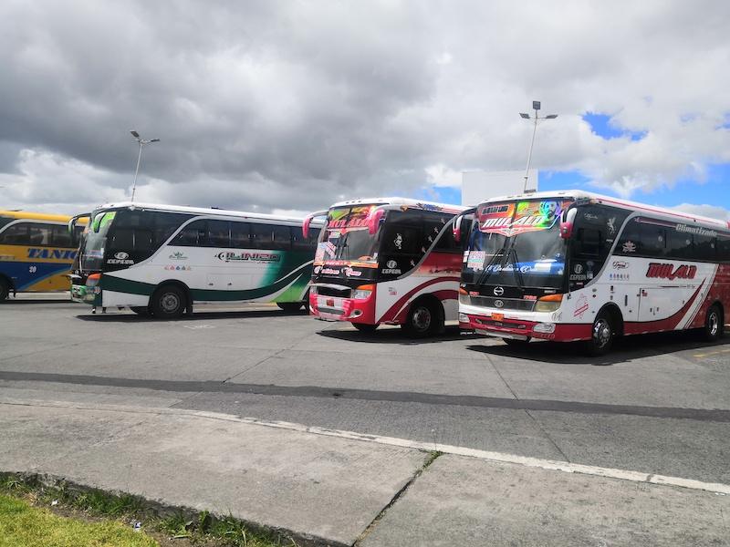
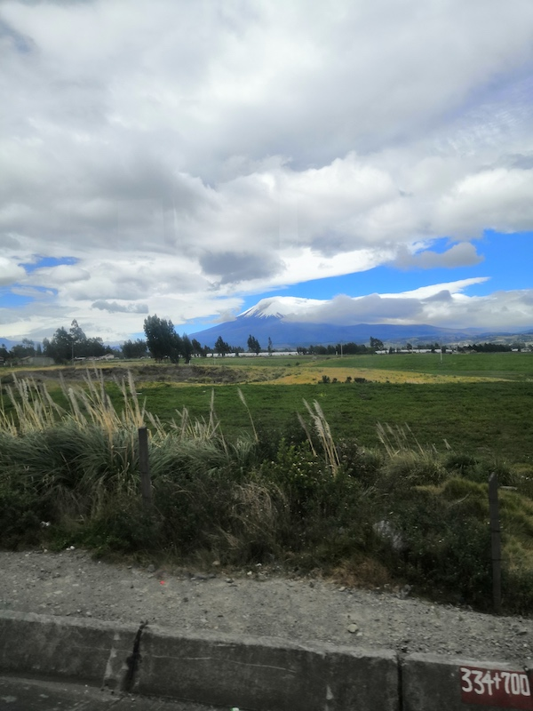
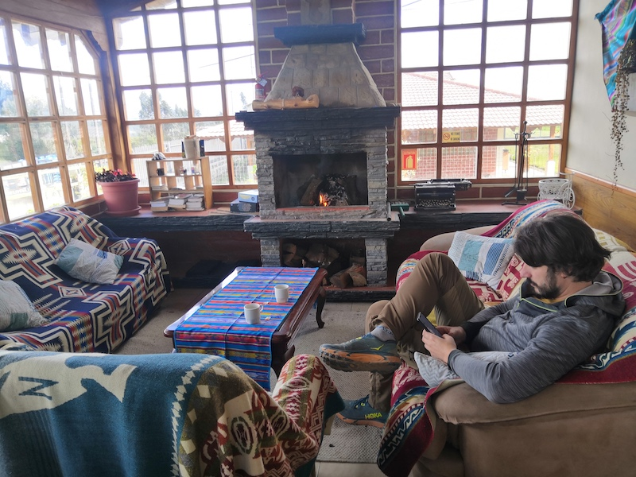
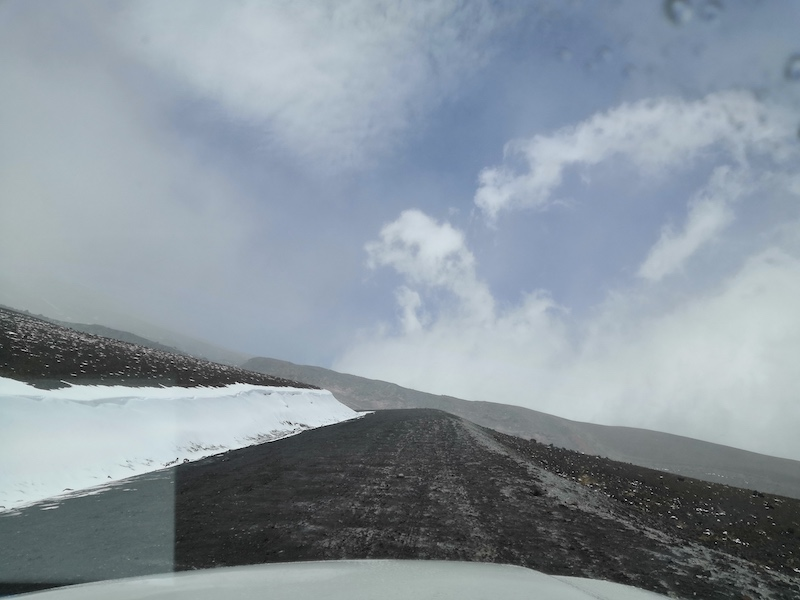
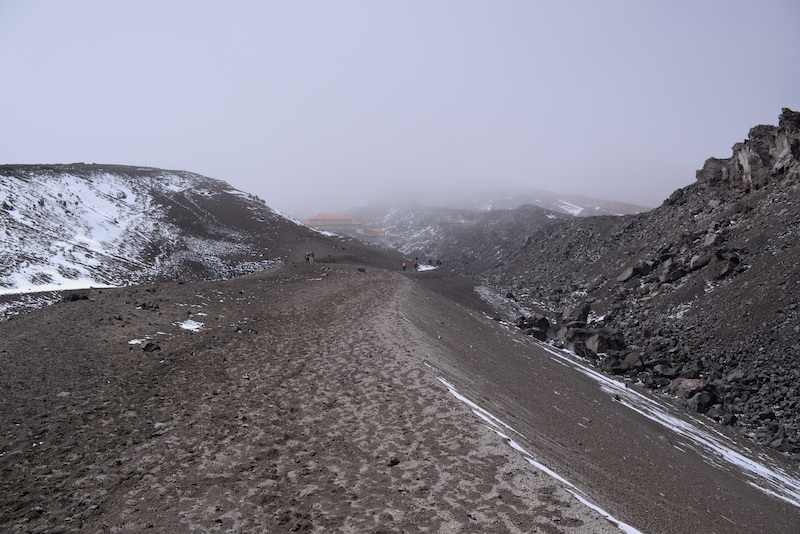
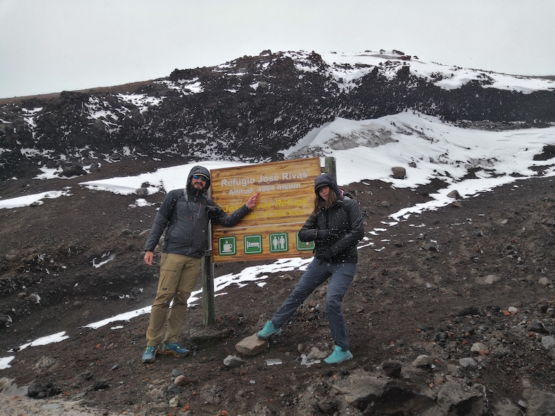
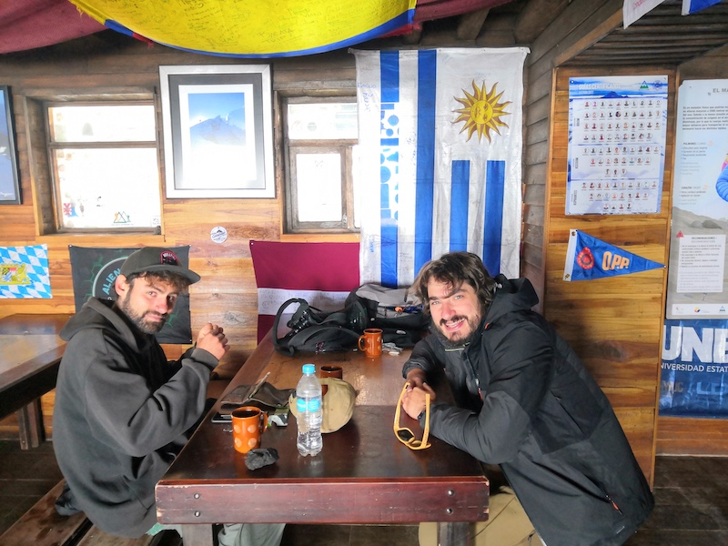
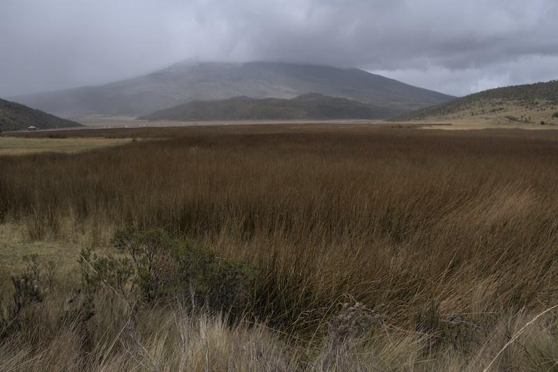

Si je vous dis qu'avec un petit doigt de pied cassé, j'ai réussi à gravir un mont blanc en 2h: vous me croyez?

Bon c'est peu la phrase "puteaclic" (désolé pour la vulgarité) d'une vidéo youtube, mais oui nous allons gravir 4864m! Je vous rassure nous ne partons
pas du niveau de la mer.

## J-1 avant l'ascension

L'objectif du jour est de rejoindre notre auberge qui se trouve à Cuscungo. En nous renseignant sur le net,
nous apprenons que la compagnie Lasso a des correspondances pour cette destination et que nous devons chercher la direction "El Chasquí".
Nous prenons la direction de la station de bus après un bon repas. Nous voilà alors sur le quai d'embarquement à la recherche de cette compagnie.
Nous nous faisons alpaguer par tous les chauffeurs nous proposant leur destination "Quito? no", "Guayaquil? no".
Bref, au bout d'un moment on repère un bus avec la bonne couleur, nous demandons au chauffeur "El Chasqui?" et nous réponds "Si, vas a Cuscungo?". Ah! Je pense qu'on est pas les premiers à vouloir
s'y rendre!

*À la recherche de notre bus*

Nous montons dans le bus. Durant le trajet, nous profitons du beau temps pour observer le Cotopaxi. Un monstre volcanique de 5897m,
toujours actif! La dernière éruption remonte à 2015... 

*Ça c'est du volcan!*

À un moment donné, notre bus quitte la route principale pour s'embarquer sur des chemins de traverse. Nous savions que c'était un bus local mais à ce point... 
Nous voilà à rouler à travers champs, le bus se transformant en 4x4, nous sommes baldingués. À notre grande surprise, 
quelques minutes plus tard, notre bus s'arrête littéralement au pied de notre auberge, pratique!

L'auberge dispose d'un salon avec un petit feu de cheminée. Nous en profitons pour bien nous reposer avec un petit thé. Au passage
nous sympathisons avec un petit jeune de 23 ans qui s'appelle Brice. Il souhaite lui aussi faire le Cotopaxi le lendemain. Nous décidons
de partager les frais du taxi et nous donnons rendez-vous le lendemain à 8h. Après un repas copieux, nous nous couchons tôt
pour être sûr d'être en forme pour demain

*L'insouciance avant le départ*

## L'ascencion

À 8h pétante, heure équatorienne, soit 8h30 heure française, notre taxi arrive. Le petit-déjeuner avait été copieux, nous montons repus
dans le taxi. Le guide très sympathique nous explique le programme de la journée, puis nous prenons la route.

Nous faisons un premier arrêt à l'entrée sud du parc. Nous en profitons pour acheter des feuilles de coca. Apparemment, c'est un
bon remède contre le mal des montagnes. Nous enfournons 3 feuilles chacun dans le côté de notre bouche et on commence à chiquer.
Honnêtement j'avais l'impression de chiquer du thé vert. Un peu perturbant au départ mais ça passe.

Nous remontons dans le taxi direction le second parking qui se situe à 4500m d'altitude. Autant vous dire qu'on était bien content
que le taxi soit une Jeep. Nous nous retrouvons embarqués sur des routes de montagnes accidentées à souhait. Nous roulons au pas
mais finissons par arriver au fameux parking.

*Autant dire que ça secoue!*

Le chauffeur nous prévient qu'il y'a 2 chemins possibles (encore une dualité...) :
1. Le chemin de gauche est plus long 1.5km mais plus facile car moins pentu
2. Le chemin en face de nous est plus court MAIS il faut faire face à une pente de plus de 45%

Nous nous regardons, et nous optons pour la solution 2. Nous sortons de la voiture et entamons l'ascension. Les 5 premières minutes
ont été très intenses de mon côté. Je ressens le manque d'air et commence un peu à paniquer. Je pense au fond de moi "ça va pas le faire".
Je me reprends et continue l'ascension. Ce sentiment d'étouffement n'a pas duré. De son côté, tout se passe bien pour Anne-Cha (pour le moment).

Au moment de prendre la direction de l'un au l'autre chemin, le temps devient exécrable. Des bourrasques de vent et de la neige s'abattent sur nous.
Le chemin numéro 1, certes plus facile, est beaucoup plus exposé car à flanc de crête. Nous nous ravisons et optons pour le chemin numéro 2.

*Pourtant il n'est pas si loin à première vue...*

Nous avançons pas à pas. De mon côté tout se passe bien, le cœur bat la chamade à cause du manque d'oxygène mais je monte à un bon rythme.
En ce qui concerne Anne-Cha, c'est beaucoup plus dur. Elle avance plus doucement. Au bout d'1h-1h15 d'effort nous parvenons tous au refuge.
Ce refuge se trouve à 4864m soit 57cm de plus que le Mont Blanc. Je ne vous ai pas menti!

*Anne-Cha fait la maligne mais ça ne va pas durer...*

Une fois au refuge nous prenons tous un chocolat chaud avant de redescendre. 

*Un choco et ça repart!*

Le trajet du retour ne prendra que 20 minutes. Le taxi nous propose alors de faire le tour de la lagune de Limpiopungo. 
Une randonnée d'une heure autour d'une lagune nichée à 3800m.

*La fameuse lagune...*

Honnêtement, il n'y a pas grand chose à voir. Par contre, cela se complique pour Anne-Cha, elle commence à avoir mal à la tête et un début de nausée.
Aïe, ce sont les signes avant-coureur du mal des montagnes. Autant vous dire que la fin d'après-midi n'a pas été du tout facile pour Anne-Cha.
Nous décidons de ne pas visiter le musée qui se trouvait sur la route pour rentrer directement à l'auberge. Anne-cha partira se coucher, de mon
côté malgré les premières minutes difficiles l'ascension s'est bien passée et je ne souffre d'aucun symptôme. Je prends soin d'elle puis vers
l'heure du dîner sa situation s'améliore. Finalement, elle pourra manger un morceau.

Après une bonne nuit de sommeil, nous reparlons de notre exploit. Nous sommes fiers d'avoir accompli un tel effort, mais nous nous rendons compte
de notre inconscience. Nous n'aurions jamais dû monter aussi haut aussi vite. Leçon est prise pour la suite de notre voyage, nous ferons
attention à bien nous acclimater avant ce genre d'ascension.

