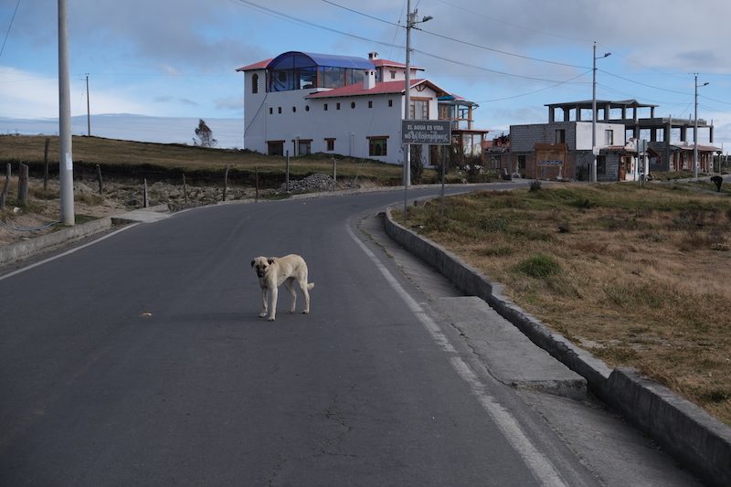
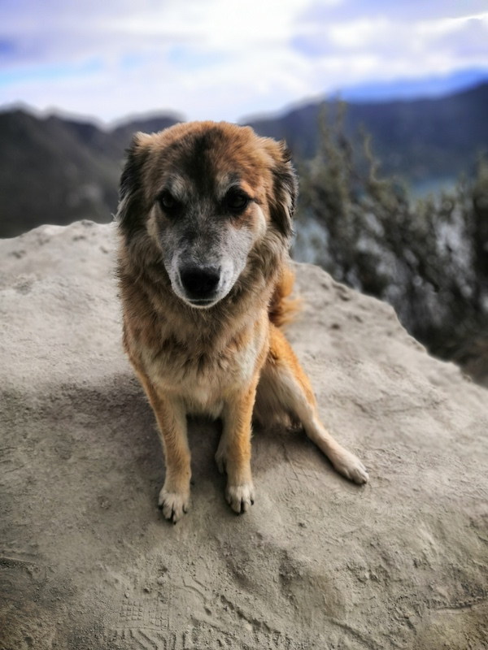
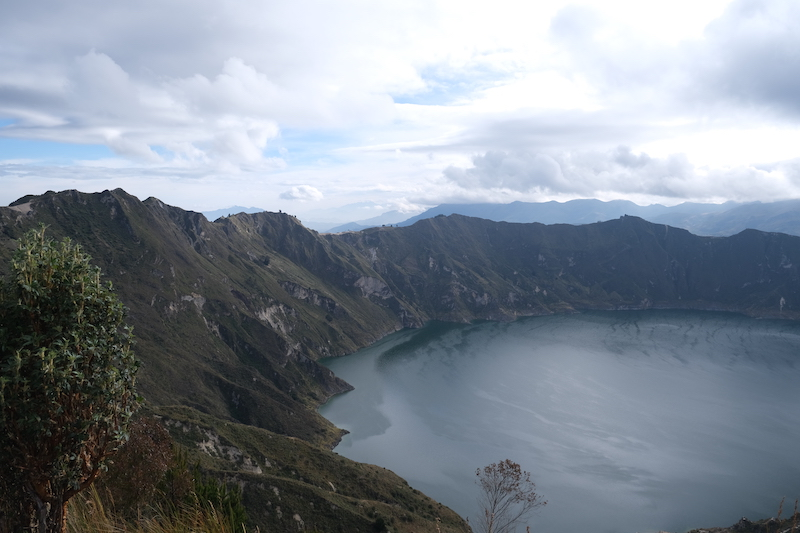
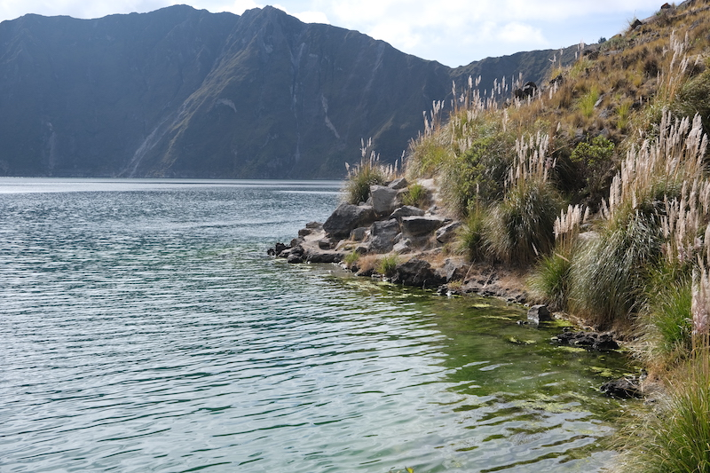
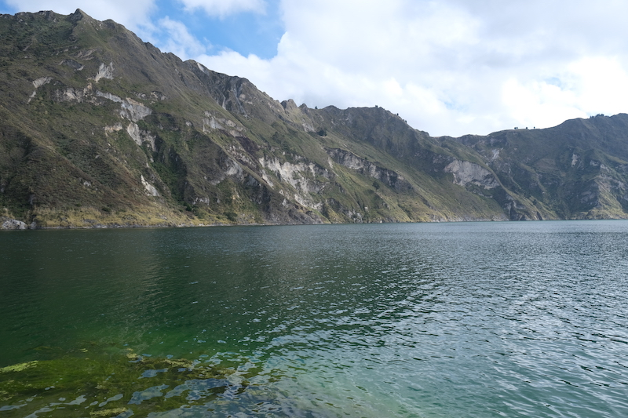
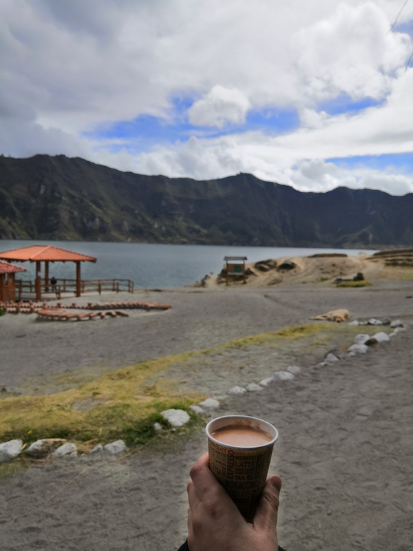
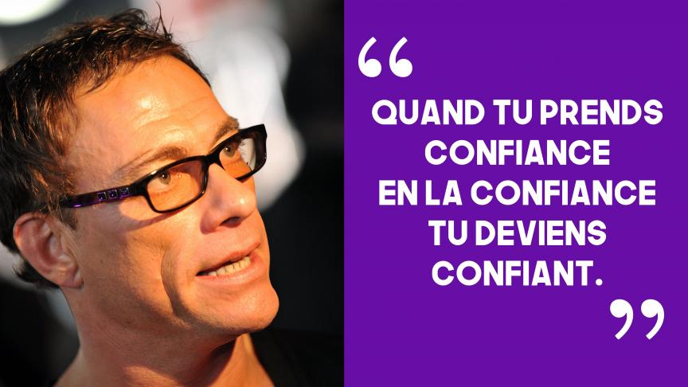

Le Quilotoa est volcan de 3984m qui a la particularité d'avoir un lac dans son cratère.

Pour nous rendre là-bas, nous décidons de partir tôt, très tôt! Nous voilà à la station de bus à 5h40
pour un départ initialement prévu à 6h. Notre chauffeur en décide autrement et prend la route à 5h50.
Nous avons bien fait d'arriver en avance...

Nous voilà embarquer pour 2h de route. Nous sillonnons les vallées des montagnes dans la brume matinale. Vers 7h,
le soleil commence à percer. Nous pouvons alors observer ces paysages verdoyants, étriqués entre les flancs de montagnes.

À 8h nous arrivons à Quilotoa, la ville. Après avoir payé notre entrée (2$ chacun), nous nous dirigeons vers le cratère.
Nous ressentons le manque d'oxygène mais rien de bien gênant. Un léger essoufflement à l'effort, rien de plus.

La ville semble à peine s'éveiller, les commerces commencent à ouvrir, pas de touriste à l'horizon (yes!). Nous sommes alors
rejoints par un adorable sac à puces qui nous fait la fête. Nous hésitons un peu à le caresser, mais vu que nous portons des gants,
nous lui faisons quelques gratouilles.

*Il n'y a pas un chat mais quelques chiens*

Voilà que ce toutou commence à nous suivre, avec Anne-Cha nous nous regardons et pensons à la même chose: nous avons trouvé
notre guide pour la journée.

*Comment dire non à cette bouille?*

Nous continuons notre chemin vers le cratère et, comme pour le grand Canyon, la magnificence du lieu ne se dévoile qu'à la
dernière seconde. Sous nos yeux ébahis, nous voyons un cratère immense et en son centre un lac dont le vert évolue avec le soleil levant.

*Ça c'est du lac*

Nous contemplons le paysage quelques minutes, puis nous nous dirigeons vers le sentier qui mène vers ce fameux lac. Un chemin de
300m de dénivelé, sableux et glissant à souhait.

Nous ne manquons pas de glisser à plusieurs reprises mais après 30 minutes de marche nous arrivons au lac. Ce lac déploie une
palette de couleurs vertes et bleues qui ravit nos yeux.

*Des couleurs magnifiques*

*Suivant le point de vue les couleurs changent*

Nous en profitons pour prendre un bon chocolat chaud car mine de rien il fait bien froid!

*Un chocolat chaud pour se redonner du moral*

Après une séance de photo souvenir, nous entamons la remontée qui est, comment dire, D-I-F-F-I-C-I-L-E! La pente est impressionnante,
les jambes brûlent, le manque d'oxygène fait que nous sommes vite essoufflés. Nous comprenons, que nous devons y aller mollo.
Nous adoptons alors la technique Jean-Claude Van Damme: step by step.

Pas à pas nous avançons. Nous faisons des pauses régulièrement pour faire redescendre le rythme cardiaque. Finalement, au bout d'1h30 d'effort,
nous parvenons à rejoindre le sommet. Nous sommes même raccompagnés par notre guide à poils longs. Avant de repartir, nous décidons de manger
un bout dans un café qui a vue sur le lac. Après un thé de coca et quelques snacks, nous reprenons la direction de Latacunga.

Autant vous dire que l'après-midi a été calme... Nous avons fait le plein d'endorphine et nous reposons car un autre monstre nous attend
dans 2 jours...
