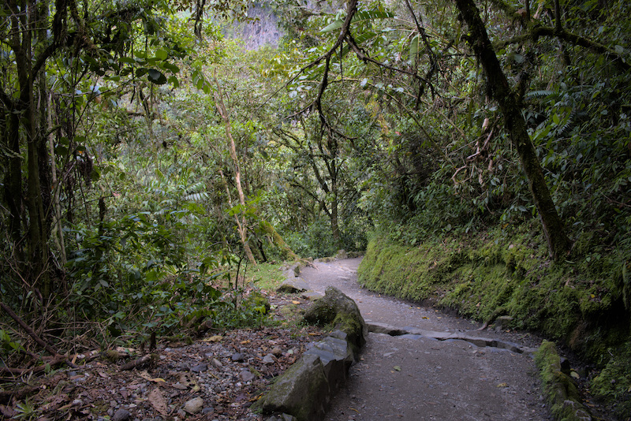
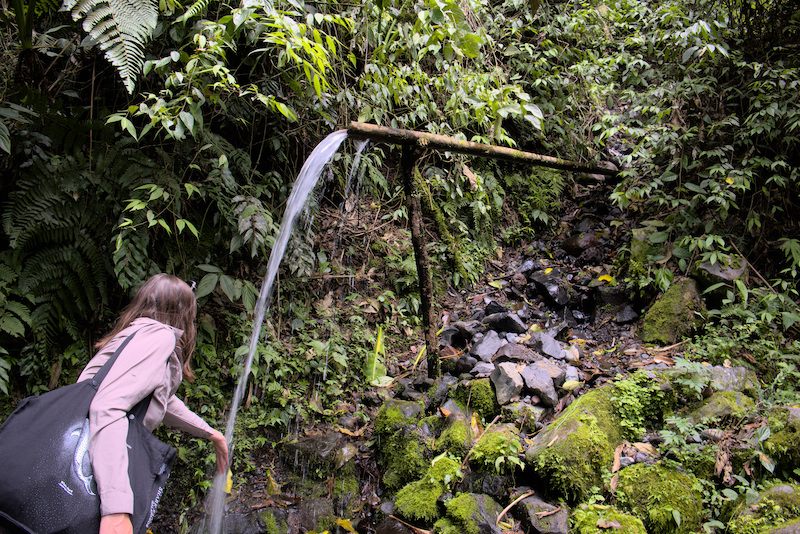
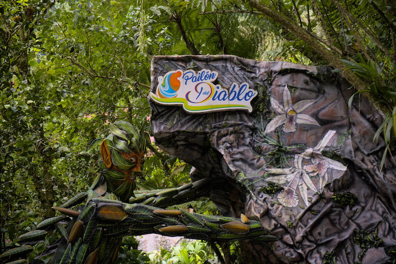

Le lendemain de notre ascension du Cotopaxi nous décidons de prendre la direction de Baños.

Cette ville est réputée pour ses sources thermales et ses massages. Quoi de mieux pour récupérer, non?
Après notre petit-déjeuner nous profitons de la connexion de l'auberge pour avancer nos articles et vers 12h
nous prenons la direction de l'autoroute...

Et oui, pour prendre le bus, il faut faire du stop sur l'autoroute qui se trouvait à 3 minutes à pied de notre auberge.
Vous avez bien lu, "faire du stop"... Nous voilà sur le bord de l'autoroute à essayer de lire les directions des bus qui
roulent à plus de 130 km/h. Autant vous dire que la tâche n'est pas si aisée. Heureusement notre pote le destin décide
de venir en aide. Après 10 minutes infructueuses, je reçois un message d'Andrea sur Whatsapp qui me demande où nous en sommes.
Je lui décris notre situation et nous répond qu'elle sera là dans 10 minutes et qu'elle peut nous amener à Baños. Vous devez
vous demander qui est cette Andrea. C'est une Équatorienne que nous avons rencontrée à l'auberge la veille. Elle souhaitait faire l'ascension
du Cotopaxi avec son compagnon. Le couple n'ayant pas de gants, nous leur avons prêté les nôtres car le lendemain ils allaient eux aussi à Baños.

Bref nous voilà en voiture en direction de cette fameuse ville thermale. Une fois sur place nous mangeons ensemble dans un petit marché.
Le fait d'avoir une personne parlant espagnol aide grandement aux négociations.

Le lendemain matin, nous souhaitons visiter une des cascades les plus hautes d'Équateur: El Pailón del Diablo. Rien que
le nom claque. Après un court trajet en bus nous voilà encore devant le dilemme des chemins:
1. Le chemin du haut permet d'accéder à la partie haute de la cascade via un enchaînement de ponts suspendus
2. Le chemin du bas lui permet d'accéder à la partie basse de la chute mais surtout de pouvoir passer derrière

Notre choix se porte rapidement sur la 2ème option. Nous voilà embarqués dans un chemin qui nous rappelle celui de la cascade
de Reina à Mindo. 

*La forêt est aussi dense qu'à Mindo*

*Petit moment rafraîchissant*

*On commence à entendre le grondement de la cascade...*

Après 30 minutes de marche, nous commençons à entendre le grondement de la cascade. Après avoir payé notre entrée,
nous apercevons enfin cette cascade. Une vidéo vaut mieux que mille mots, je vous laisse vous faire votre opinion.

<iframe width="560" height="315" src="https://www.youtube.com/embed/y9oyqf8xdfs" title="YouTube video player" frameborder="0" allow="accelerometer; autoplay; clipboard-write; encrypted-media; gyroscope; picture-in-picture" allowfullscreen></iframe>

Pour pouvoir accéder à la partie qui se cache derrière la cascade, le chemin devient alors une expédition spéléologique.
Nous nous retrouvons à ramper dans des galeries dont la hauteur ne dépasse guère les 80 cm. Après avoir rampé, roulé, rentré
le ventre, extirpé, marché à quatre pattes, nous nous retrouvons au pied de la cascade. Le bruit est assourdissant! Nous parvenons
à nous retrouver derrière la cascade moyennant une bonne douche froide. Par chance, nous avions croisé un couple de français
que nous avions rencontré à Mindo et qui avaient gentiment prêté leur poncho. Malgré cet équipement, la douche n'en était pas moindre.

Le retour fut un peu plus compliqué car le chemin est pentu.

Le soir nous retrouvons ce fameux couple pour leur rendre les ponchos et profiter d'un moment de détente dans les thermes.
Les anciens thermes de Baños se situent à proximité de la cascade de La Virgen. C'est un édifice constitué de 3 piscines: 42°c, 38°c
et une glaciale. Il faut préciser que cette eau est naturelle et revêt une couleur marron qui peut surprendre. Néanmoins, ce bain fait
un bien fou aux jambes. Nous finirons la soirée en beauté sur quelques délicieux mojitos dans un bar aux ambiances hipster.
