Bon on va pas se le cacher, la ville de Huaraz n'a rien d'exceptionnel. 

Effectivement, si l'on va à Huaraz c'est principalement pour faire des randonnées et voir de magnifiques paysages de haute
altitude. Haute altitude qui au passage a eu raison de Anne-Cha dès le premier jour.

Après 48h de supplice, Anne-Cha est fin prête pour partir pour notre 1ère randonnée d'acclimatation. Mais d'abord c'est quoi une randonnée
d'acclimatation??? Tout simplement, le corps a besoin de temps pour s'habituer à l'altitude. La technique est de faire des randonnées en montant
progressivement le point culminant à chaque fois mais surtout de redescendre à son point de départ pour dormir. Nous visons donc 3 randonnées:
1. La laguna de Wilcacocha (3900m)
2. La laguna de Churup (4450m)
3. La laguna 69 (culmine à 4600m): le clou du spectacle

## Laguna Wilcacocha

C'est l'une des randonnées d'acclimatation les plus simples et les plus accessibles du coin. Rendez-vous est pris à 8h pour embarquer dans
un collectivo qui nous déposera au milieu d'une route 45 minutes plus tard.

Commence alors l'ascension en suivant des routes en lacet qui ressemblent plus à des pistes. La montée est douce, trop douce. Après
avoir croisé différents paysages allant de la micro forêt, au village en passant par les champs nous faisons face à un dilemme.
2 choix s'offrent à nous... Encore??? vous allez me dire, Eh! oui... comme à chaque fois un est plus direct mais plus dur, l'autre plus soft
mais plus long.

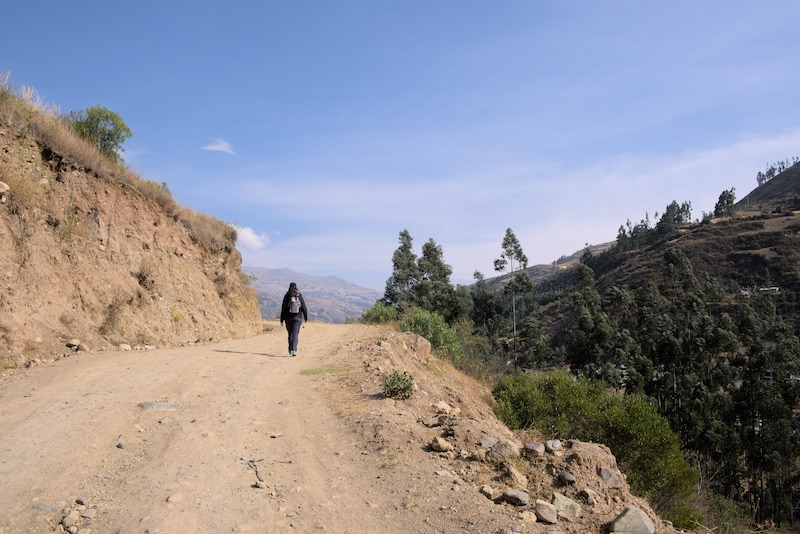
*Au début ça ne monte pas trop*

Notre âme de randonneur nous incite à suivre la voie la plus directe! Nous voilà embarqués sur des chemins rocailleux avec des pentes allant
de pentue à très très pentue en passant par très pentue. Nous avons l'occasion de croiser des locaux dont une petite fille qui
empêchera purement et simplement Anne-Cha de prendre des photos... du paysage... Sacré caractère celle-là!

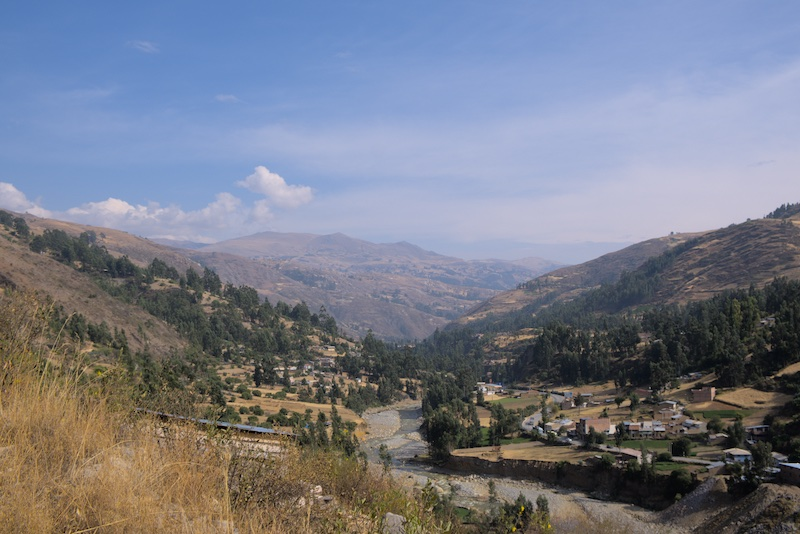
*Petite aperçu du paysage en marchant*

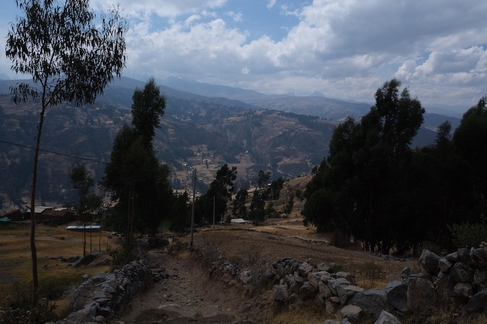
*Ça monte sec par ici*

On ne va pas se le cacher, les derniers mètres de l'ascension ont été assez compliqués physiquement car on sent le manque de souffle et le cœur
se met à battre la chamade. Heureusement une fois arrivée nous apercevons la fameuse laguna Wilcacocha. J'aimerais vous dire
que nos efforts avaient été récompensés mais cette randonnée ne sert vraiment qu'à s'acclimater. La laguna est loin de valoir celle de
Quilotoa

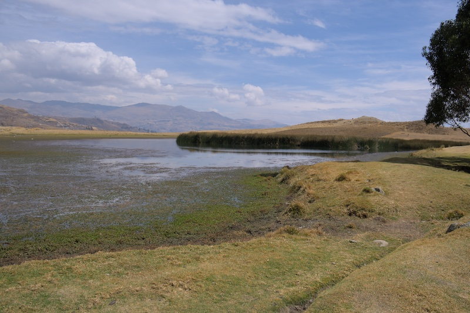
*Ce n'est clairement pas la plus belle laguna*

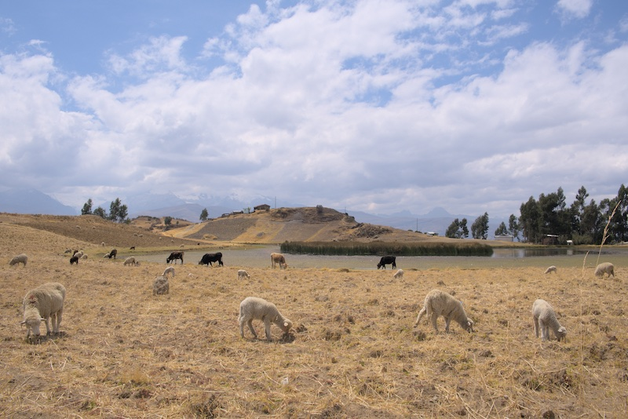
*Bon ok les mouton rattrapent un peu le paysage*

## Laguna Churup

Après une première randonnée d'acclimatation réussie haut la main, nous embarquons pour la randonnée de Churup! Nous
revoilà parti pour prendre un collectivo. Cependant le trajet durera un peu plus longtemps (environ 1h). Il nous dépose au point de départ du trek
qui se situe à 3900m d'altitude (rien que ça...).

Le départ est beaucoup moins évident que la précédente randonnée. Nous luttons avec nos bâtons loués la veille pour pouvoir les régler à la bonne hauteur.
Après 10mn de longue bataille nous voilà engagé sur le chemin du Trek. Il commence par une succession de marches rocailleuses
plus ou moins grandes. Le manque d'air nous rappelle vite à l'ordre, il faut prendre son temps! Le tempo: un pas après l'autre!

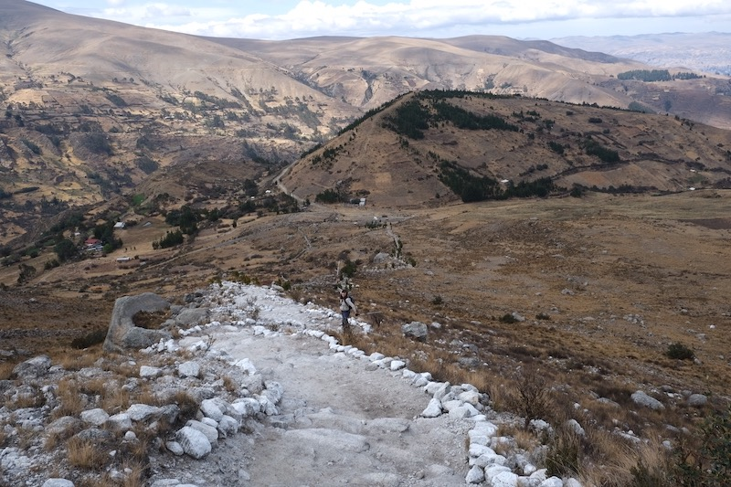
*L'insouciance d'Anne-Cha*

Après plus d'une heure de montée nous arrivons au premier refuge. Les paysages sont magnifiques bien plus impressionnants que ceux de
Wilcacocha. La 2ème partie de l'ascension est plutôt facile car le chemin est assez plat. Bon on omettra un petit passage où il faut
s'aider d'une chaîne pour gravir un mur de pierre. Anne-Cha et son passé de championne de bloc n'a eu aucun mal à se défaire de cet obstacle.

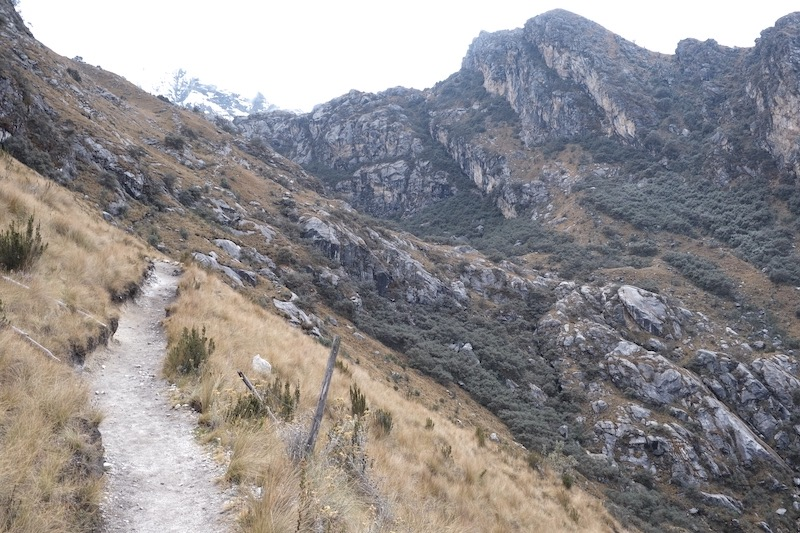
*La partie la plus facile de l'ascension*

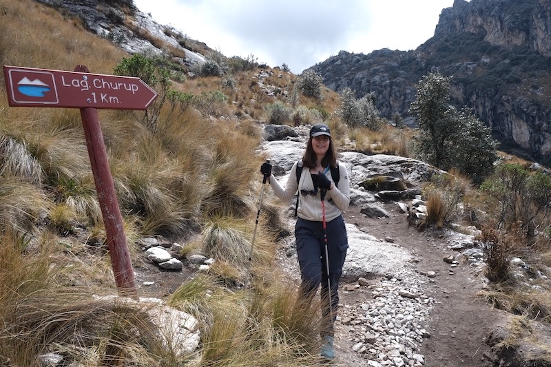
*Si proche et pourtant si loin...*

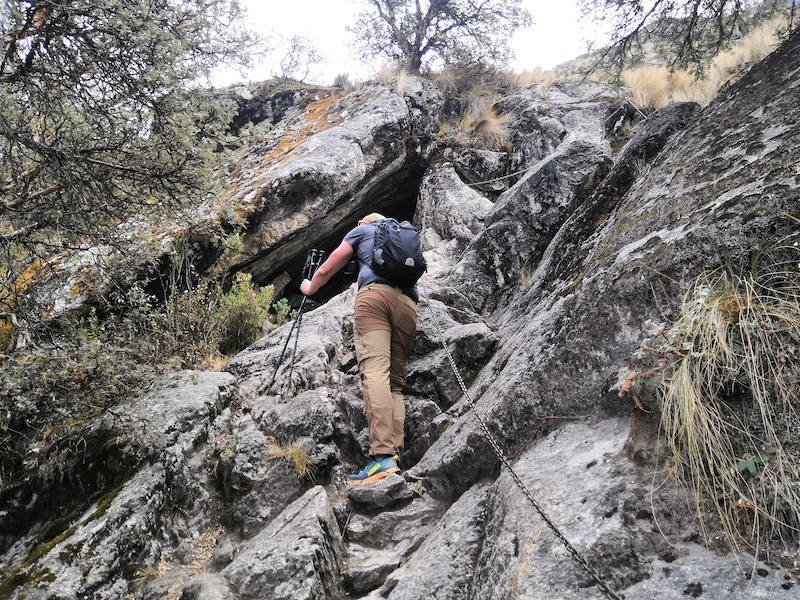
*Le premier passage un peu technique*

La suite se corse un peu, ça monte, ça monte dur! Viens encore ce fichu dilemme des chemins, sauf que celui censé être difficile inclut
un passage qui apparemment est assez délicat. Nous optons pour un chemin plus facile. Que nenni, nous nous trompons de direction
et nous retrouvons sur le chemin difficile... Après 1h de montée supplémentaire nous entrapercevons le sommet. Tiens, c'est bizarre on
a pas vu de partie "délicate". Tout simplement que ce fameux sommet n'en était pas un! Nous voilà face à un flanc de montagne, avec une chaîne
comme seule aide pour pouvoir franchir des murs de pierre plus lisses les uns que les autres. Par chance il n'avait pas plu, nous
pouvons donc assurer nos appuis.

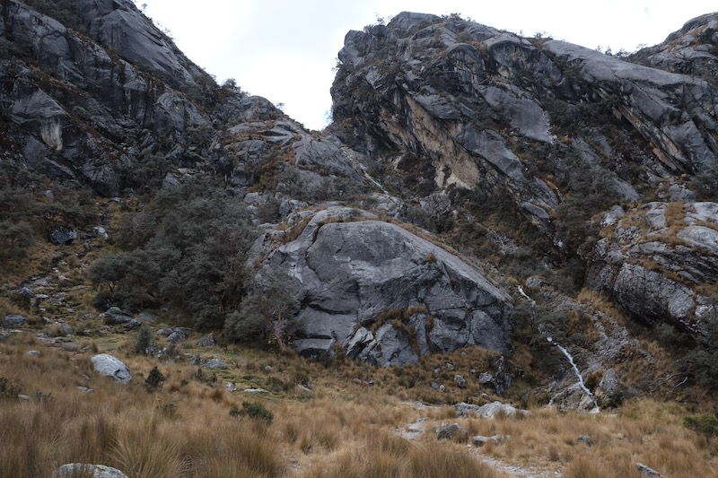
*Le fameux passage "délicat"*

Après des passages vraiment impressionnant, nous arrivons épuisés mais satisfaits à 4450m d'altitude. Cette-fois ci l'effort en valait
vraiment la peine. Les couleurs du lac sont magnifiques et le calme qui règne est apaisant.

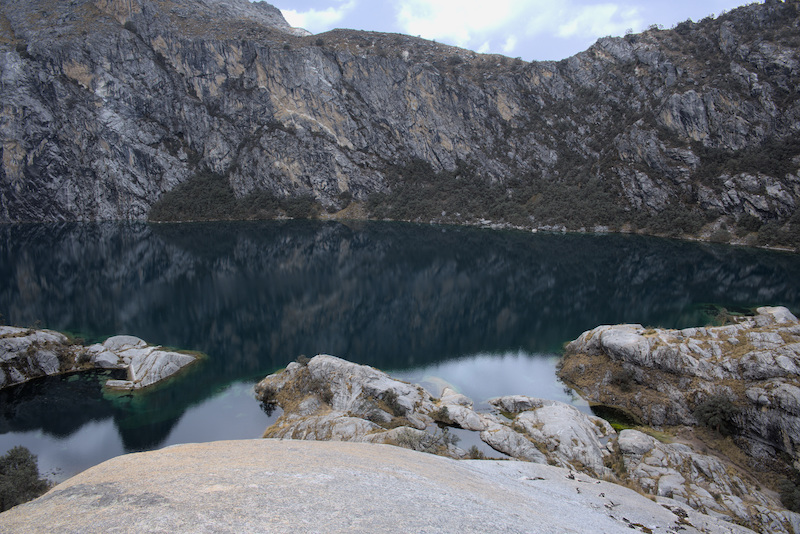
*La vue récompense vraiment les efforts*

Après un léger encas, nous devons repartir car nous avons un horaire fixe pour retourner à notre collectivo. 3h devant nous ça devrait le faire!
C'était sans compter sur le fait qu'Anne-Cha ait usé de toutes ses ressources pour atteindre le sommet. Le retour sera pour elle un vrai
calvaire... Je vous passe les détails mais Anne-Cha a su se dépasser et nous sommes revenus 10mn en avance par rapport à l'heure indiquée.

Bravo Anne-Cha, je suis fier de toi!

# Laguna 69

Hmm comment vous décrire la situation. La laguna s'est transformée en chute du Niagara pour moi... Je vous passe les détails mais nous ne verrons
jamais la laguna 69