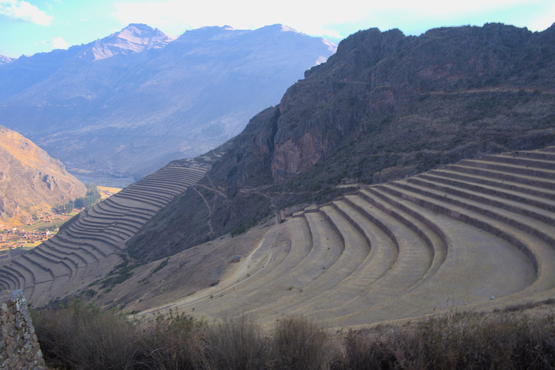

Lors d'un tour du monde on a beau avoir du temps, on ne peut pas tout voir non plus...

Sauf quand une agence propose 2 tours en 1 pour visiter la fameuse vallée sacrée en une journée! Banco, nous prenons les billets et nous
voilà embarqués dans un tour express avec des locaux!

# Chincherro

1er arrêt Chincherro, tout le monde descend! Nous débutons notre visite par un site archéologique où on en apprend un peu
plus sur les techniques d'agriculture des incas. Nous avons face à nous de nombreuses terrasses construites à la force des bras.
Ils sont forts ces incas, très forts!

*Les fameuses terrasses*

Le lieu est impressionnant car vraiment grand, il est niché entre d'immenses montagnes. Mais Chincherro ce n'est pas qu'un site,
c'est aussi un haut lieu de l'artisanat local avec comme produit phare la laine d'Alpaca (notamment celle des bébés).

Nous nous dirigeons alors vers le centre culturel où une dame nous explique tout le processus pour fabriquer de la laine
d'Alpaca. Tout est fait avec des produits naturels, pour dire, la couleur rouge provient d'une sorte de petite larve parasite écrasée...

*Quelques exemples de produits naturels pour la teinture*

*Elle est vraiment douce ta laine, tu m'en prêtes?*

Vient le moment des achats où nous avons fait quelques folies. Nous trouvons notre bonheur chacun avec des pulls en laine
de bébé Alpaca. J'espère qu'il n'aura pas trop froid le pauvre :(

# Maras

2ème arrêt Maras! On commence par entrer dans une petite pièce pour nous expliquer comment est fabriqué le sel de maras.
L'eau qui s'écoule le long de la montagne se charge de sel. Les incas ont donc construit des salinière à fleur de montagne.
L'ensemble ressemble à un complexe de piscines avec différentes couleurs suivant la qualité du sel:
1- La fleur de sel très blanche
2- Le sel raffiné qui se teinte de rose typique de cette région
3- Le sel industriel dont la couleur marron ne donne guère envie

*Et oui il y'a quelqu'un qui verse l'eau du ciel*

Après toutes ces explications nous nous dirigeons vers le mirador pour observer ces salinières. Autant vous dire, le spectacle
est à couper le souffle! Des salinières à perte de vue, chacune revêtant une couleur différente. Nous prenons le temps de contempler
le lieu et prenons quelques photos souvenirs.

*La vue est tout bonnement impressionnante*

# Ollantaytambo

3ème arrêt: Ollantaytambo et son temple du soleil! Nous faisons face à une forteresse immense où des combats acharnés entre les incas
et les espagnols ont eu lieu.

Après avoir gravi plus de 200 marches (les doigts dans le nez), la vallée jouit d'une palette de couleur que l'on ne trouve nulle
part ailleurs.

*Plus que 200 marches*

*Ça en valait l'effort*

La visite du temple du soleil sera assez courte car il n'en reste que les murs. Le plus impressionnant est de savoir que les
énormes blocs de roche proviennent de la montagne voisine à plus de 13 km. Même si beaucoup aimeraient croire que les
extraterrestres ont donné un coup de main, il n'en est rien. Les incas utilisaient un système de rampe avec de la terre et
faisaientt rouler les blocs sur des troncs d'arbres couplé avec des roches en forme de roue. On sent la fierté du guide
envers ses ancêtres et on peut le comprendre.

# Pisaq

Dernier arrêt, Pisaq et ses champs en terrasse. Beaucoup plus impressionnant en termes de taille que Chincherro, ce lieu vaut
vraiment le détour. On y apprend que les incas ont construit des réserves de nourriture qui pouvaient être conservées jusqu'à 25 ans
rien que ça. De quoi faire pâlir n'importe quel réfrigérateur moderne. La contrepartie est que le site est fortement exposé
au vent, j'ai failli perdre Anne-Cha à plusieurs reprises.

*Des terrasses à n'en plus finir*

Bon je vous ai menti pour le dernier arrêt car en fait notre ultime arrêt fut dans une boutique d'orfèvrerie où le gérant
nous a vanté les mérites énergétiques des pierres péruviennes. Ce dernier arrêt faisait vraiment attrape-touriste et après plus de 8h
sur la route nous avions hâte de rentrer.

