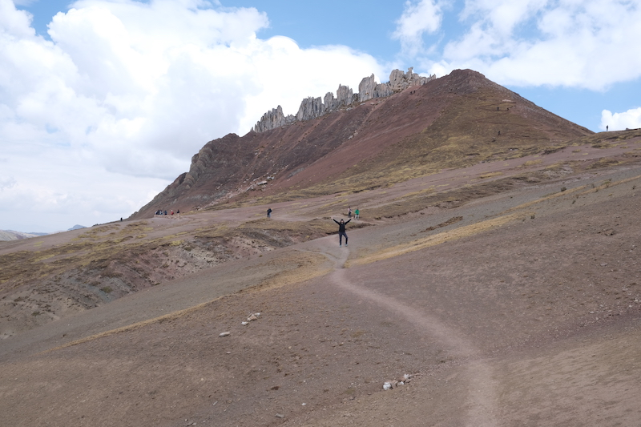
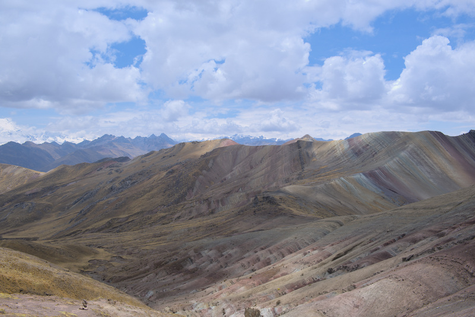
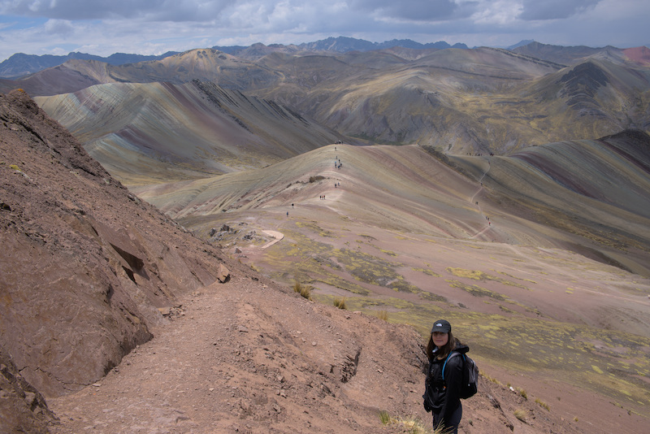
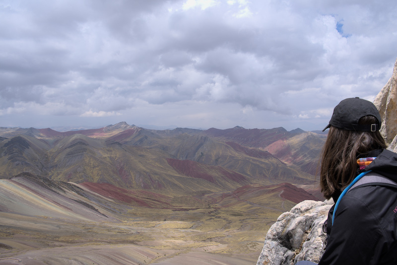
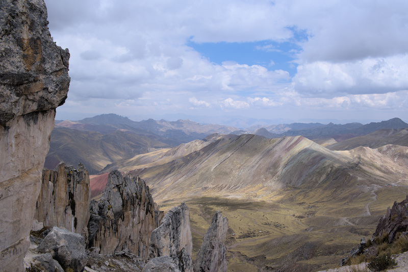

Palcoyo est la petite sœur de Vinicunca, la montagne des 7 couleurs.

Cependant Palcoyo est beaucoup moins touristique et apparemment toute aussi belle, il n'en fallait pas plus pour nous convaincre.
Rendez-vous est pris pour un départ à 5h du matin, enfin c'est ce qui était prévu...

En effet, nous nous levons vers 4h pour nous préparer et à 4h15 la personne de l'hôtel nous informe qu'un mini van nous attend. Ah!
En moins de 10 minutes, nous étions prêts et sur le pied de guerre!

Bon la route a été longue et la frugalité du petit-déjeuner "buffet" inclus n'a pas aidé à faire passer le temps.

Après plus de 4 heurs de routes sinueuses nous sommes débarqués à l'entrée du Trek, où nous ne reverrons jamais notre "guide"...

Nous commençons l'ascension à 4800m avec pour but d'atteindre le sommet à 5050m. Une fois
accoutumé au manque d'air, la marche est plutôt tranquille car la pente n'a rien de comparable à ce que l'on avait pu faire
auparavant. Nous avons trouvé ça limite un peu facile...

*Anne-Cha a encore pas mal d'énergie à revendre*

Après une petite heure de marche nous arrivons au niveau d'une crête et par chance le soleil se lève un peu. La montagne
révèle alors une palette de couleurs magnifiques. Nous prenons le temps de contempler puis continuons notre périple en direction
de la forêt de pierres.

*On voit rarement des couleurs comme ça dans la nature*

La dernière partie était un peu plus pentue mais pas de quoi casser 3 pattes à un canard. Après 15-20 minutes d'efforts
nous voilà au sommet! Ah, j'oubliais le plus important: record d'altitude battu (5050m)! Nos petits cœurs haletant d'alpiniste en herbe
étaient fiers de leur exploit.

Il reste difficile de décrire dans un article la grandeur et la splendeur d'un lieu alors quelques photos valent mieux que des mots.

Le retour se passera mieux avec un repas plus consistant, le mal des montagnes n'a qu'à bien se tenir sauf pour notre voisin italien
qui n'aura pas eu la chance de garder son repas bien longtemps...

